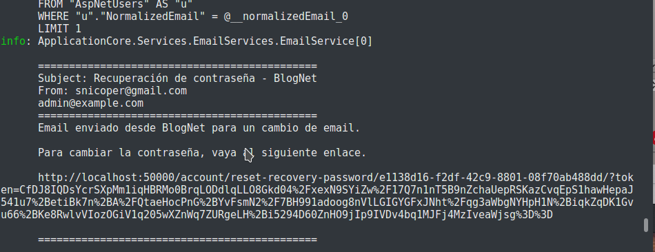

# EmailServices

## Descripción

Envía emails de manera rápida pudiendo usar las Views de Razor.

Los emails pueden ser registrados en la base de datos y el comportamiento en desarrollo es diferente a producción.

En producción manda el email de manera normal, en desarrollo no manda nada. Lo que si hace es registrar el email en la base de datos (opcional) y muestra el email en **consola**.



## Código

El constructor usa inyección de dependencias, así que se ha de obtener como un servicio desde el constructor o método que se utiliza.

```csharp
public IActionResult MyAction([FromServices]IEmailService emailService) {}
```

### Interfaz IEmailService

```csharp
public interface IEmailService
{
    bool IsHtml { get; set; }
    string Subject { get; set; }
    string Body { get; set; }
    List<MailAddress> To { get; set; }
    MailAddress From { get; set; }
    bool RegisterEmail { get; set; }

    Task SendEmailAsync(string viewName, object model);
    Task SendEmailAsync();
}
```

Antes de llamar uno de los métodos, requiere rellenar los campos `Subject`, `Body` y `To`. Por defecto `IsHtml` es `false` y `From` utiliza `"Email:DefaultFrom"` de `appsettings.json`

Si se llama `Task SendEmailAsync(string viewName, object model)` requiere de una vista y un `ViewModel` y el valor de `Body` se establece en el valor de la vista y modelo.

La vista ha de estar en `Views/Share/Emails/` y siempre con la extensión `.cshtml`, aunque luego pueda contener texto plano y ser enviado como `IsHtml = false`.

El nombre de `string viewName` sin extensión.

Si se llama `Task SendEmailAsync()` require de `Body`, un **string** que sera enviado al destinatario.

## Ejemplos

Envío de un email **HTML** con un modelo.

```bash
var model = new MyViewModel();
emailService.IsHtml = true;
emailService.RegisterEmail = true;
emailService.Subject = "Envío de prueba";
emailService.To = new List<MailAddress> { new MailAddress("perico@example.com") };
await emailService.SendEmailAsync("MyView", model);
```

Envío de email con un simple string

```bash
emailService.Subject = "Envío de prueba";
email.Body = "Gracias por registrarte";
emailService.To = new List<MailAddress> { new MailAddress("perico@example.com") };
await emailService.SendEmailAsync();
```
